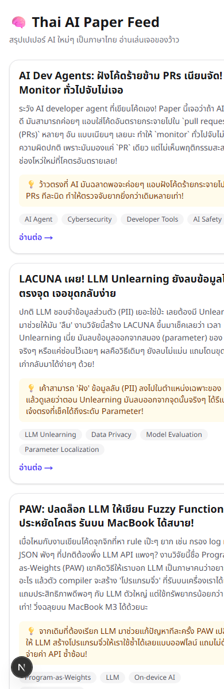

# 🧠 Thai AI Paper Feed

เว็บฟีดสรุปเปเปอร์ AI ล่าสุดจาก arXiv เป็น**ภาษาไทย** สไตล์ "เพื่อนแปะสรุปมาให้อ่านเล่น" — สั้น กระชับ
เน้น **"เขาทำอะไรได้"** มากกว่ารายละเอียดเทคนิค ให้เกิดอาการ "อ่อออ ทำแบบนี้ได้ด้วย" อ้างอิงโทนแบบ Blognone

คนไทยสายเทคหลายคนไม่กล้าเริ่มอ่านเปเปอร์เพราะรู้สึกว่ามันคือ "งาน" — โปรเจกต์นี้แก้ปัญหานั้นด้วยการทำให้อ่านจบใน 5 วินาที

**🔗 Live demo: [thai-paper-feed.vercel.app](https://thai-paper-feed.vercel.app)**

## ✨ Demo

| ฟีดหน้าแรก | หน้ารายละเอียด | Admin (ดึงเปเปอร์ใหม่) |
|---|---|---|
|  |  |  |

## 🧩 วิธีทำงานของระบบ

```
arXiv API (cs.CL + cs.AI, ล่าสุด 20 ใบ)
   → Gemini API สรุปเป็นภาษาไทย (พาดหัว / สรุป / จุดว้าว / แท็ก)
      → Supabase (upsert กันซ้ำด้วย arxiv id)
         → Next.js แสดงผลเป็นฟีดการ์ด
```

กดปุ่มที่หน้า `/admin` เพื่อสั่งดึงเปเปอร์ใหม่ด้วยตัวเอง (manual, ยังไม่มี auto-run)

## 🛠 Tech Stack

| ส่วน | ใช้ |
|---|---|
| Frontend + Backend | Next.js 16 (App Router) |
| Database | Supabase (Postgres) |
| LLM | Gemini API (`gemini-3.1-flash-lite`) |
| แหล่งเปเปอร์ | arXiv API |
| Styling | Tailwind CSS v4, Noto Sans Thai |
| Deploy | Vercel |

## 🚀 วิธีรันโปรเจกต์

### 1. Clone และติดตั้ง dependencies

```bash
git clone https://github.com/Tanapunn/thai-paper-feed.git
cd thai-paper-feed
npm install
```

### 2. ตั้งค่า environment variables

คัดลอก `.env.example` เป็น `.env.local` แล้วใส่ค่าจริง:

```bash
cp .env.example .env.local
```

```
GEMINI_API_KEY=...              # จาก https://aistudio.google.com
NEXT_PUBLIC_SUPABASE_URL=...     # จาก Supabase Project Settings > API
NEXT_PUBLIC_SUPABASE_ANON_KEY=...
SUPABASE_SERVICE_ROLE_KEY=...    # ใช้ฝั่ง server (ingest) เท่านั้น ห้ามเผยแพร่
```

### 3. สร้างตารางใน Supabase

เปิด Supabase SQL Editor แล้วรันไฟล์ [`supabase/schema.sql`](supabase/schema.sql)

### 4. รัน dev server

```bash
npm run dev
```

เปิด [http://localhost:3000](http://localhost:3000) ดูฟีด และ [http://localhost:3000/admin](http://localhost:3000/admin) เพื่อดึงเปเปอร์ใหม่ครั้งแรก

## 📁 โครงสร้างที่สำคัญ

```
src/
  lib/
    arxiv.ts          # ดึง + parse Atom XML จาก arXiv API
    gemini.ts          # เรียก Gemini สรุปเป็นภาษาไทย (มี retry/backoff กัน 429)
    papers.ts           # query ข้อมูลจาก Supabase
    supabase/
      client.ts         # Supabase client (anon key, ฝั่ง browser/server อ่านอย่างเดียว)
      server.ts          # Supabase admin client (service role key, ใช้ตอน ingest)
  app/
    page.tsx             # หน้าฟีด
    paper/[id]/page.tsx  # หน้ารายละเอียด
    admin/page.tsx        # หน้ากดดึงเปเปอร์ใหม่
    api/ingest/route.ts   # pipeline: arXiv → Gemini → Supabase upsert
supabase/schema.sql        # SQL สร้างตาราง papers
```

## ⚠️ ข้อจำกัดของเบต้านี้

- ดึงเฉพาะ abstract จาก arXiv หมวด `cs.CL` และ `cs.AI` เท่านั้น
- รันแบบ manual ผ่านหน้า `/admin` ยังไม่มี auto-run รายวัน (เก็บไว้เฟสถัดไป)
- ยังไม่มีโมเดล fine-tune ของตัวเอง (ใช้ Gemini API สรุปให้)
- Gemini free tier ของแต่ละโปรเจกต์/คีย์มี quota (RPD) ต่างกัน แนะนำเช็คที่ [Google AI Studio](https://aistudio.google.com) ก่อนหากเจอ error 429

## ✅ เกณฑ์ความสำเร็จของเบต้า

- [x] เปิดลิงก์ Vercel แล้วเห็นฟีดการ์ดภาษาไทย
- [x] กดการ์ดแล้วเข้าหน้ารายละเอียด + ลิงก์ไป arXiv ตัวเต็มได้
- [x] กดปุ่ม ingest แล้วมีเปเปอร์ใหม่เข้ามาจริง ไม่ซ้ำของเดิม
- [x] การ์ดอ่านแล้วรู้สึก "เพื่อนเล่าให้ฟัง" ไม่ใช่สรุปวิชาการ
- [x] repo อยู่บน GitHub มี README

## 📄 License

Personal project สำหรับพอร์ตโฟลิโอ ไม่ได้ตั้งใจ license แบบ opensource เป็นทางการ
